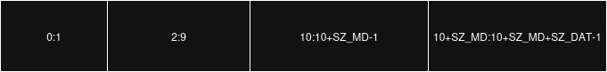

# Rawdog: Comms

## Overview

This module defines the basic communication protocol that is used in Rawdog TCP Communications. The `send` and `receive` functions are defined here.

## Packet Breakdown



- **Block 1**: First two bytes. This holds the size of the metadta block that is being transmitted.
- **Block 2**: Next eight bytes. This holds the size of the data block that is being transmitted.
- **Block 3**: Next SIZE METADATA (`SZ_METADATA`) bytes. This is the metadata that is being transmitted.
- **Block 4**: Next SIZE DATA (`SZ_DAT`) bytes. This is the data/payload that is being transmitted. This is expected to be `base64-encoded` data.

_note: all byte blocks are expected to be in Big Endian formatting._

### Metadata

```json
{
  "Agentname": "my-cutsom-agent",
  "Endpoint": 0,
  "Addldata": ""
}
```

- **Agentname**: This is the equivalent of HTTP's `User-Agent` header.
- **Endpoint**: Server endpoint that will process the transmission. This is **required** for client-to-server transmissions.
- **Addldata**: Any additional metadata that is to be transmitted.
